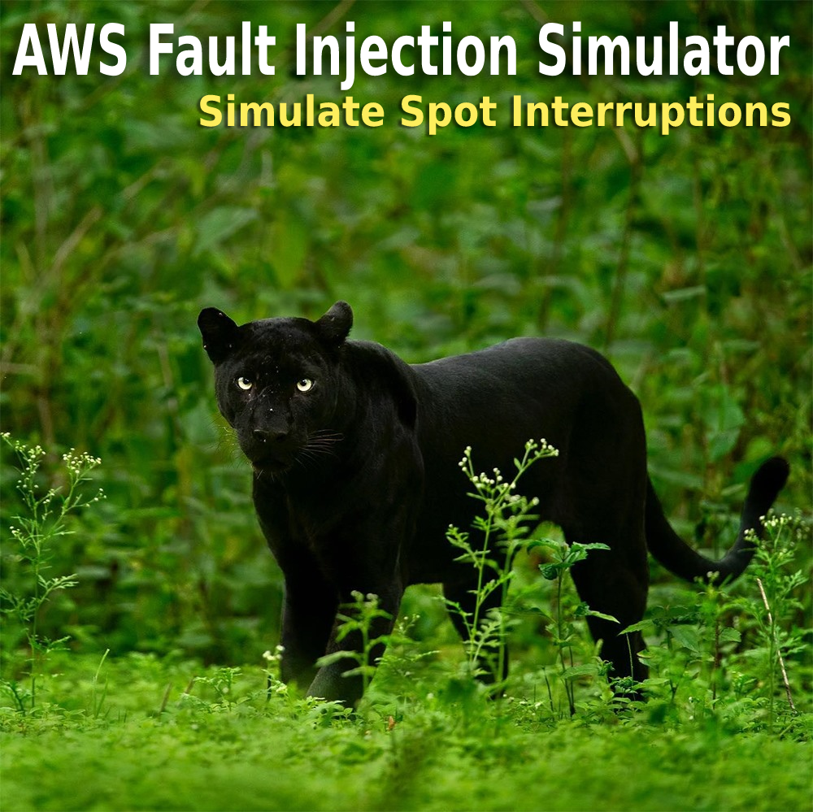
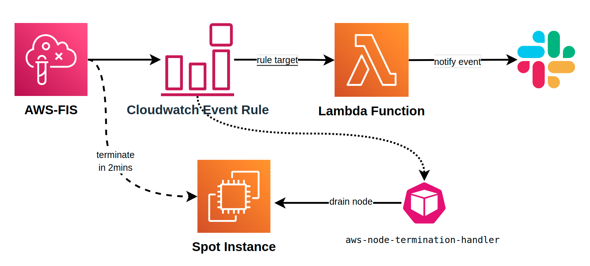
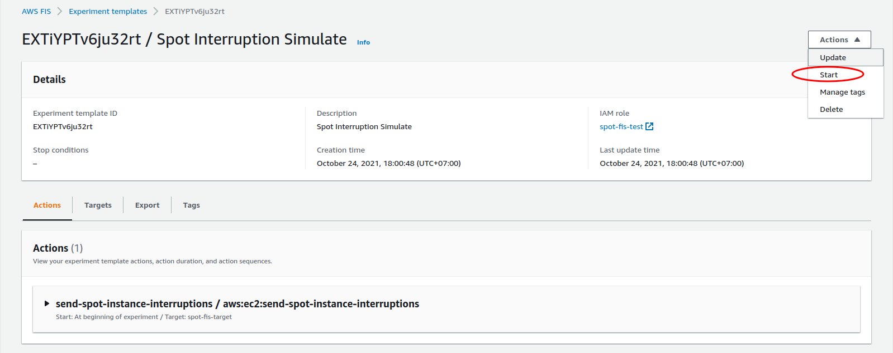
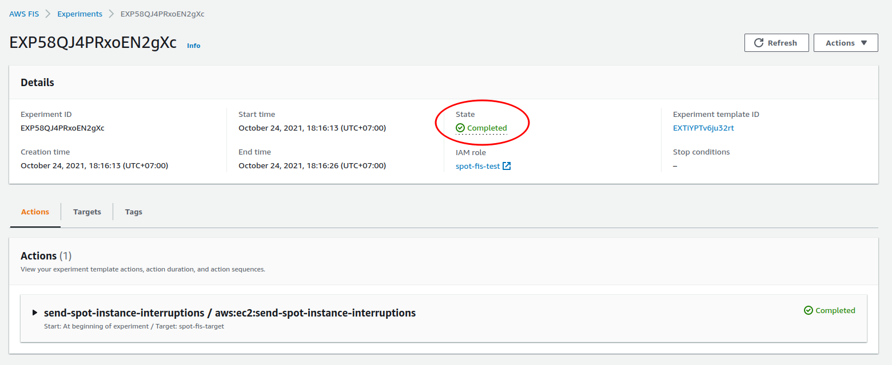
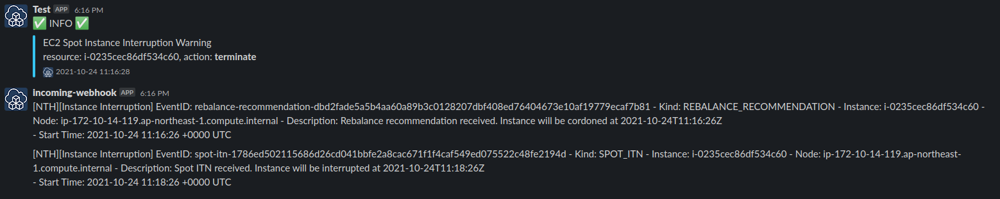

<p align="center">
  <a href="https://dev.to/vumdao">
    
  </a>
</p>
<h1 align="center">
  <div><b>Simulate Spot Interruptions Using AWS Fault Injection Simulator</b></div>
</h1>

## Abstract
- [AWS Fault Injection Simulator now supports Spot Interruptions](https://aws.amazon.com/about-aws/whats-new/2021/10/aws-fault-injection-simulator-spot-interruptions/), now you can trigger the interruption of an Amazon EC2 Spot Instance using AWS Fault Injection Simulator (FIS).
- With FIS, you can test the resiliency of your workload and validate that your application is reacting to the interruption notices that EC2 sends before terminating your instances.
- This blog guide you step-by-step to create FIS Experiment templates using AWS CDK

## Table Of Contents
 * [Overview of EC2 spot instance](#Overview-of-EC2-spot-instance)
 * [Simulate Spot Interruptions architect](#Simulate-Spot-Interruptions-architect)
 * [Create Lambda function - send slack](#Create-Lambda-function---send-slack)
 * [Create event rule of spot interruption](#Create-event-rule-of-spot-interruption)
 * [Create FIS service role](#Create-FIS-service-role)
 * [Create FIS Experiment Template](#Create-FIS-Experiment-Template)
 * [Start experiment template](#Start-experiment-template)
 * [Conclusion](#Conclusion)

---

## 🚀 **Overview of EC2 spot instance** <a name="Overview-of-EC2-spot-instance"></a>
- [Amazon EC2 Spot Instances](https://dev.to/awscommunity-asean/aws-eks-with-amazon-ec2-spot-instances-405o) reduce the cost up to 90% but can be interrupted or reclaimed at any time with warning in 2 mins.
- We can use [`aws-node-termination-handler`](https://github.com/aws/aws-node-termination-handler) to ensures that the Kubernetes control plane responds appropriately to events that can cause your EC2 instance to become unavailable

## 🚀 **Simulate Spot Interruptions architect** <a name="Simulate-Spot-Interruptions-architect"></a>
- Starting the FIS experiment will send `send-spot-instance-interruptions` event.
- Use cloudwatch event rule to catch `EC2 Spot Instance Interruption Warning` event and then trigger lambda function for sending slack notifications.
- `aws-node-termination-handler` kubernetes DaemonSet also takes action when catching the event



---
## **Now we start creating CDK stacks**

## 🚀 **Create Lambda function - send slack** <a name="Create-Lambda-function---send-slack"></a>
- Lambda handler

    <details>
    <summary>app.py</summary>

    ```
    import requests
    from datetime import datetime
    import json


    def send_slack(msg):
        """ Send payload to slack """
        webhook_url = "https://hooks.slack.com/services/******"
        footer_icon = 'https://cdkworkshop.com/images/new-cdk-logo.png'
        color = '#36C5F0'
        level = ':white_check_mark: INFO :white_check_mark:'
        curr_time = datetime.now().strftime('%Y-%m-%d %H:%M:%S')
        payload = {"username": "Test",
                "attachments": [{
                                    "pretext": level,
                                    "color": color,
                                    "text": f"{msg}",
                                    "footer": f"{curr_time}",
                                    "footer_icon": footer_icon}]}
        requests.post(webhook_url, data=json.dumps(payload), headers={'Content-Type': 'application/json'})


    def handler(event, context):
        detail_type = event.get('detail-type', '')
        instance_id = event['detail']['instance-id']
        action = event['detail']['instance-action']
        message = f'{detail_type}\nresource: {instance_id}, action: *{action}*'
        send_slack(message)

    ```

    </details>

- Lambda stack
  
    <details>
    <summary>lambda.ts</summary>

    ```
    const send_slack = new lambda.Function(this, 'slackLambda', {
                description: 'Send Event message to slack',
                runtime: lambda.Runtime.PYTHON_3_8,
                code: lambda.Code.fromAsset('lambda-code/app.zip'),
                handler: 'app.handler',
                functionName: 'send-slack-spot-event'
            });
    ```

    </details>

## 🚀 **Create event rule of spot interruption** <a name="Create-event-rule-of-spot-interruption"></a>
- The event listens to `EC2 Spot Instance Interruption Warning` to trigger the above lambda function
  
    <details>
    <summary>event.ts</summary>

    ```
            const spot_event = new event.Rule(this, 'SpotEventRule', {
                description: 'Spot termination event rule',
                ruleName: 'spot-event',
                eventPattern: {
                    source: ['aws.ec2'],
                    detailType: ['EC2 Spot Instance Interruption Warning'],
                    detail: {
                        'instance-action': ['terminate']
                    }
                }
            });

            spot_event.addTarget(new event_target.LambdaFunction(send_slack));
    ```

    </details>

## 🚀 **Create FIS service role** <a name="Create-Lambda-function---send-slack"></a>
- IAM role for AWS FIS permissions to handle the target resources here is EC2 instance
  
    <details>
    <summary>fis_role.ts</summary>

    ```
            const fis_role = new iam.Role(this, 'FisRole', {
                roleName: 'spot-fis-test',
                assumedBy: new iam.ServicePrincipal('fis.amazonaws.com')
            });

            const ec2_policy_sts = new iam.PolicyStatement({
                sid: 'SpotFisTest',
                effect: iam.Effect.ALLOW,
                actions: [
                    'ec2:DescribeInstances',
                    'ec2:StopInstances',
                    'ec2:SendSpotInstanceInterruptions'
                ],
                resources: ['arn:aws:ec2:ap-northeast-1:*:instance/*'],
                conditions: {
                    'StringEquals': {'aws:RequestedRegion': props?.env?.region}
                }
            });

            fis_role.addToPolicy(ec2_policy_sts);
    ```

    </details>

## 🚀 **Create FIS Experiment Template** <a name="Create-FIS-Experiment-Template"></a>
- The experiment template includes:
  - Action: `send-spot-instance-interruptions`, parameter: `durationBeforeInterruption` `PT2M`
  - Targets:
    - Resource type: `aws:ec2:spot-instance`
    - Resource filters: `State.Name=running`
    - Selection mode: `COUNT(1)`

- Stack

    <details>
    <summary>fis.ts</summary>

    ```
            const target: fis.CfnExperimentTemplate.ExperimentTemplateTargetProperty = {
                resourceType: 'aws:ec2:spot-instance',
                resourceTags: {'eks:nodegroup-name': 'eks-airflow-nodegroup-pet'},
                selectionMode: 'COUNT(1)',
                filters: [{
                    path: 'State.Name',
                    values: ['running']
                }]
            };

            const action: fis.CfnExperimentTemplate.ExperimentTemplateActionProperty = {
                actionId: 'aws:ec2:send-spot-instance-interruptions',
                parameters: {'durationBeforeInterruption': 'PT2M'},
                targets: {'SpotInstances': 'spot-fis-target'}
            };

            const fis_exp = new fis.CfnExperimentTemplate(this, 'FisExperiment', {
                description: 'Spot Interruption Simulate',
                roleArn: fis_role.roleArn,
                tags: {
                    'Name': 'spot-interrupt-test',
                    'cdk': 'fis-stack'
                },
                stopConditions: [
                    {source: 'none'}
                ],
                targets: {'spot-fis-target': target},
                actions: {'send-spot-instance-interruptions': action}
            });
    ```

    </details>

## 🚀 **Start experiment template** <a name="Start-experiment-template"></a>
- Start
  


- Complete
  


- Slack notify the event and `aws-node-termination-handler` action either
  


## 🚀 **Conclution** <a name="Conclution"></a>
- This kind of FIS experiment help us to test the scenario of spot interruption to check `aws-node-termination-handler` and fault tolerance of application
- We should also know about [FIS pricing](https://aws.amazon.com/fis/pricing/). The AWS FIS price is `$0.10` per action-minute.

---

<h3 align="center">
  <a href="https://dev.to/vumdao">:stars: Blog</a>
  <span> · </span>
  <a href="https://github.com/vumdao/clickhouse-troubleshooting/">Github</a>
  <span> · </span>
  <a href="https://stackoverflow.com/users/11430272/vumdao">stackoverflow</a>
  <span> · </span>
  <a href="https://www.linkedin.com/in/vu-dao-9280ab43/">Linkedin</a>
  <span> · </span>
  <a href="https://www.linkedin.com/groups/12488649/">Group</a>
  <span> · </span>
  <a href="https://www.facebook.com/CloudOpz-104917804863956">Page</a>
  <span> · </span>
  <a href="https://twitter.com/VuDao81124667">Twitter :stars:</a>
</h3>
